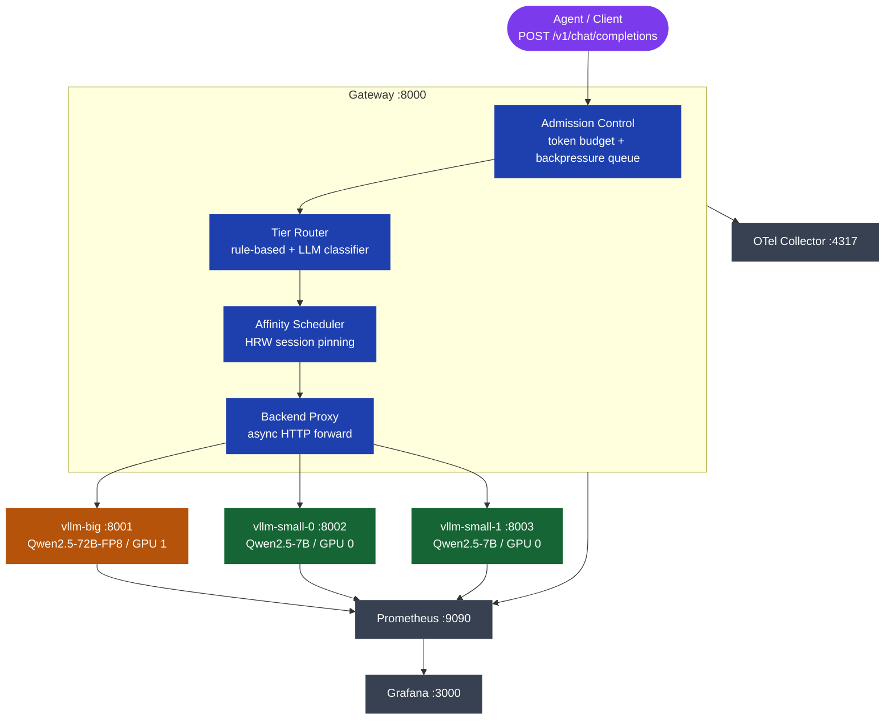

# agent-serve

A self-hosted LLM serving gateway for agentic traffic, running on dual 96 GB workstation GPU GPUs (96 GB GDDR7 each). It wraps three vLLM backends behind a single OpenAI-compatible endpoint and handles everything the gateway layer needs to: session pinning for KV-cache reuse, two-tier routing (7B for fast tasks, 72B for complex ones), per-agent token budgets, and backpressure queuing. A pre-wired Grafana dashboard ships out of the box.

## Architecture



## Load Study Results

### Small-tier saturation

Two 7B instances on a single GPU handle sustained load without collapsing. Latency plateaus from c=4 through c=16 with p99 under 25 s at all tested concurrency levels.


| Concurrency | N | p50 | p95 | p99 |
|:-----------:|:-:|:---:|:---:|:---:|
| c=1  | 24  | 8.8 s | 11.1 s | 11.1 s |
| c=4  | 96  | 18.2 s | 23.0 s | 24.2 s |
| c=8  | 192 | 17.9 s | 23.1 s | 25.0 s |
| c=16 | 384 | 18.5 s | 22.5 s | 23.9 s |

### Session affinity

HRW session pinning keeps each agent session on the same vLLM backend, letting the 3 KB system prompt stay in the KV cache across turns. The difference between sessions with sticky routing and sessions without is a clear hit/miss split:


| Condition | Hit Rate | p50 E2E |
|-----------|:--------:|:-------:|
| Affinity ON (sticky session IDs, 6 turns/session) | 83.3% | 18.5 s |
| Affinity OFF (fresh ID per request, 1 turn/session) | 0.0% | 19.4 s |

The 83.3% hit rate is the theoretical exact value for 6-turn sessions (turn 1 = always miss, turns 2-6 = always hit). The gateway scheduler reports truthfully.

## Features

- **OpenAI-compatible API** -- `/v1/chat/completions` and `/v1/models`, streaming and non-streaming
- **Two-tier routing** -- small (7B x2) for factual Q&A and short tasks, big (72B) for complex generation; tier selected by header, prompt length, or LLM classifier
- **HRW session affinity** -- same session always routes to the same backend for KV-cache reuse
- **Tool calling** -- full `tool_calls` / `tool_call_id` round-trip supported on both tiers (Hermes parser)
- **Per-agent token budgets** -- sliding-window rate limiting per `agent_id`; 429 on exhaustion
- **Backpressure queue** -- bounded global queue; 503 on overflow, not silent slowdown
- **Health probe + auto-failover** -- backends marked DOWN after 3 consecutive failures (~30 s), back UP after 2 successes
- **Prometheus + Grafana** -- pre-provisioned dashboard with traffic, latency, scheduling, and economics panels
- **OTel tracing** -- distributed traces via OTLP gRPC to any compatible backend

## Quickstart

### Prerequisites

- Docker Engine with Docker Compose v2 (`docker compose`, not `docker-compose`)
- 2x 96 GB workstation GPU GPUs (96 GB each) with NVIDIA Container Toolkit installed
- A Hugging Face token with access to the model repos
- About 200 GB free disk space for model weights

### Steps

```bash
# Clone
git clone https://github.com/rajeev-chaurasia/agent-serve.git
cd agent-serve

# Set up environment
cp .env.example .env
# Edit .env and set HF_TOKEN to your Hugging Face token

# Start the stack (model downloads happen on first run and take a while)
docker compose up -d

# Watch startup until both vLLM instances are ready
docker compose logs -f vllm-big vllm-small-0
```

When the logs show `Application startup complete`, the stack is ready.

### Smoke Test

```bash
# Gateway health
curl http://localhost:8000/healthz

# Chat via small tier
curl http://localhost:8000/v1/chat/completions \
  -H "Content-Type: application/json" \
  -d '{
    "model": "auto",
    "messages": [{"role": "user", "content": "What is the capital of France?"}],
    "max_tokens": 32
  }'

# Check which backend served it
# Look for x_agent_serve.tier and x_agent_serve.backend_id in the response
```

Or just run:

```bash
make smoke
```

### Demo Agent

A tool-calling agent that reads files, searches a knowledge corpus, runs Python snippets, and evaluates expressions:

```bash
python3 -m demo_agent.run_session --sessions 3
```

## Development

```bash
# Install gateway dev dependencies
make install

# Run tests
make test

# Lint
make lint

# Both
make check
```

## Directory Structure

```
agent-serve/
├── configs/
│   ├── gateway.yaml              routing, affinity, admission, health config
│   ├── vllm-big.env              big-tier vLLM flags
│   ├── vllm-small.env            small-tier vLLM flags
│   ├── prometheus.yml            scrape config
│   ├── otel-collector.yaml       OTLP pipeline config
│   └── grafana/                  pre-provisioned dashboard and datasources
├── gateway/
│   └── src/agent_serve/
│       ├── core/                 shared enums, Pydantic models, schemas
│       ├── config/               YAML config loader
│       ├── backends/             registry, health checker, proxy
│       ├── accounting/           per-agent token budget
│       ├── admission/            queue and admission controller
│       ├── routing/              rule-based router + LLM classifier
│       ├── affinity/             HRW session scheduler
│       ├── telemetry/            Prometheus metrics, OTel, structured logging
│       └── gateway/              FastAPI app, routes, lifespan, dependencies
├── demo_agent/                   tool-calling agent for end-to-end testing
├── loadgen/                      closed-loop load generator with CSV output
├── studies/                      load study scripts and results writeup
├── docs/                         detailed guides (architecture, routing, affinity, config)
├── MODELS.md                     model pinning, VRAM budgets, vLLM flag history
└── RUNBOOK.md                    operations, failure recovery, scaling knobs
```

## Documentation

- [Architecture](docs/architecture.md) -- system components, data flow, subpackage layout
- [Routing](docs/routing.md) -- how tier decisions are made (rules, classifier, headers)
- [Affinity](docs/affinity.md) -- HRW session pinning and prefix-cache reuse
- [Load Study](docs/load-study.md) -- study methodology and full measured results
- [Configuration](docs/configuration.md) -- every config field explained
- [MODELS.md](MODELS.md) -- deployed model checksums and VRAM budget
- [RUNBOOK.md](RUNBOOK.md) -- startup, failure modes, health checks, Grafana
