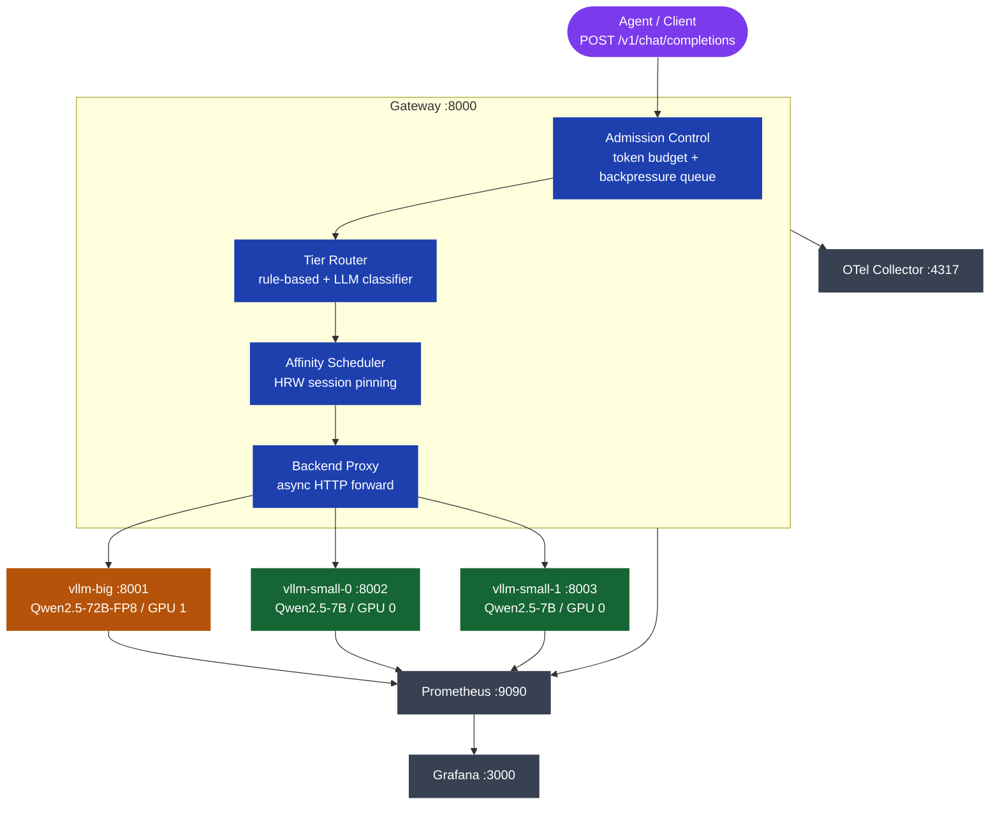

# Architecture

agent-serve is a self-hosted LLM serving gateway for agentic traffic. It runs on bare metal with two 96 GB NVIDIA GPUs and wraps three vLLM inference backends behind a single OpenAI-compatible HTTP endpoint.

## System Overview



## Components

### Gateway

The gateway is a FastAPI async application (`gateway/src/agent_serve/`). Every incoming request travels through a fixed pipeline:

```
Request
  |
  v
AdmissionController
  - check per-agent token budget (sliding window)
  - enqueue in BackpressureQueue (bounded, 429/503 on overflow)
  |
  v
TierRouter
  - check X-Tier-Hint header (small / big / auto)
  - if auto: run RuleBasedRouter, then ClassifierRouter if rules are inconclusive
  |
  v
AffinityScheduler
  - look up session_id in sticky-binding table
  - if bound: route to the pinned backend (cache hit)
  - if not bound: pick backend via HRW score, write binding
  |
  v
BackendProxy
  - async HTTP proxy to the chosen vLLM backend
  - streaming (SSE) and non-streaming both supported
  - on failure: raise 502, let health probe update backend status
  |
  v
Response + x_agent_serve metadata
  - tier, backend_id, affinity_hit, queue_wait_ms
```

### vLLM Backends

Three vLLM instances serve inference:

| Name | GPU | Model | Context | Notes |
|------|-----|-------|---------|-------|
| vllm-big | GPU 1 | Qwen2.5-72B-Instruct-FP8 | 8192 tokens | FP8 quantization, prefix caching on |
| vllm-small-0 | GPU 0 | Qwen2.5-7B-Instruct | 16384 tokens | BF16, prefix caching on, 45% VRAM |
| vllm-small-1 | GPU 0 | Qwen2.5-7B-Instruct | 14000 tokens | BF16, prefix caching on, 43% VRAM |

All three use the Hermes tool-call parser (`--tool-call-parser hermes`), enabling OpenAI-compatible tool calling with the `function_call` and `tool_calls` fields.

vllm-small-0 and vllm-small-1 share GPU 0. The VRAM split is slightly asymmetric: small-0 uses `gpu_memory_utilization=0.45` and small-1 uses `0.43`. During startup, CUDA graph capture by small-0 temporarily holds extra memory, which would cause small-1 to fail its KV cache allocation at the higher setting. At 0.43, the combined allocation (0.45 + 0.43) x 96 GB = 84.5 GB fits within budget.

### Health Checker

A background task (`backends/health.py`) probes every backend every 10 seconds. After 3 consecutive failures it marks the backend `DOWN` and removes it from the healthy-backend pool. After 2 consecutive successes it marks the backend `UP` and re-adds it. The gateway router only selects from healthy backends, so a dead backend is automatically bypassed within roughly 30 seconds.

### Admission Control

Two layers protect the backends from being overwhelmed:

1. **Per-agent token budget**: each `agent_id` gets a rolling token window (default 100K tokens per 60s). The `TokenAccountant` tracks input + output token counts from each response and rejects at 429 when the budget is exhausted.

2. **Backpressure queue**: an asyncio queue with a configurable depth. When the queue is full the gateway returns 503 immediately rather than queuing indefinitely and degrading latency for all clients.

### Observability

- **Prometheus**: the gateway and all three vLLM backends expose `/metrics`. Prometheus scrapes all four at 15s intervals. Key metrics include request counts and latencies by tier, affinity hit/miss counters, queue depth and wait times, and token budget rejection rates.

- **Grafana**: a pre-provisioned dashboard (loaded from `configs/grafana/`) with four rows: traffic and latency, scheduling, backend status, and economics (tokens per second by tier).

- **OTel**: the gateway emits OpenTelemetry traces via OTLP gRPC to the collector at port 4317. The collector config (`configs/otel-collector.yaml`) can be updated to forward traces to Jaeger, Tempo, or any OTLP backend.

## Subpackage Layout

```
gateway/src/agent_serve/
├── core/          shared enums, Pydantic models, schemas, exceptions
├── config/        GatewayConfig loader (YAML + env override)
├── backends/      BackendRegistry, HealthChecker, BackendProxy, protocols
├── accounting/    TokenAccountant, SnapshotManager (budget persistence)
├── admission/     AdmissionController, BackpressureQueue
├── routing/       RuleBasedRouter, ClassifierRouter, TierRouter
├── affinity/      AffinityScheduler (HRW), protocols
├── telemetry/     Prometheus metrics, OTel tracing, structured logging
└── gateway/       FastAPI app, lifespan, dependencies, routes (chat, health, metrics)
```

Every subpackage exposes a `typing.Protocol` that the FastAPI dependency injection layer wires up to the concrete class. This means tests can swap in fakes without touching business logic, and modules never import concrete classes from sibling subpackages.

## Request Flow Example

An agent sends:

```json
POST /v1/chat/completions
X-Session-Id: agent-42-turn-7
X-Tier-Hint: auto
{
  "model": "auto",
  "messages": [
    {"role": "system", "content": "..."},
    {"role": "user", "content": "What is the capital of France?"}
  ]
}
```

1. Gateway extracts `session_id=agent-42`, `agent_id` from header (or body default)
2. `AdmissionController` checks budget for `agent_id`, enqueues the request
3. `TierRouter` sees `tier_hint=auto`, calls `ClassifierRouter` which asks vllm-small-0 and gets `{"tier": "small"}`
4. `AffinityScheduler` looks up `session-42-turn-7` -- it was seen 6 turns ago and is pinned to `small-1`
5. `BackendProxy` forwards to `http://vllm-small-1:8003/v1/chat/completions`
6. vLLM finds the system-prompt KV block already in prefix cache (cache hit)
7. Response arrives, gateway attaches `x_agent_serve: {tier: small, backend_id: small-1, affinity_hit: true, queue_wait_ms: 2.1}` and returns
