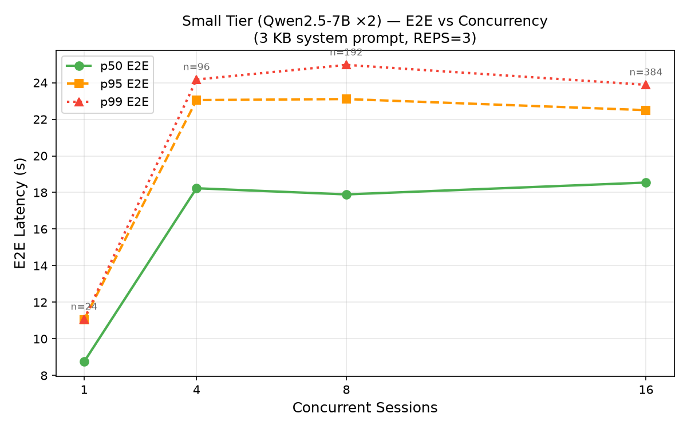
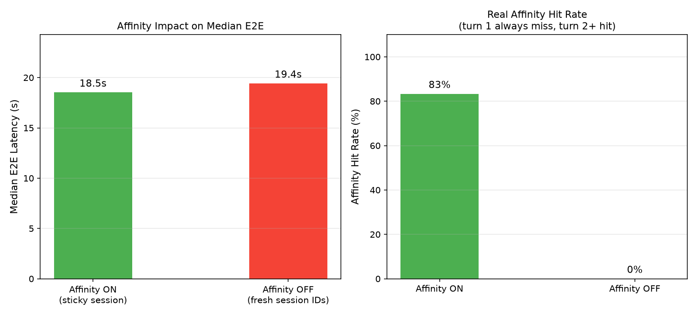
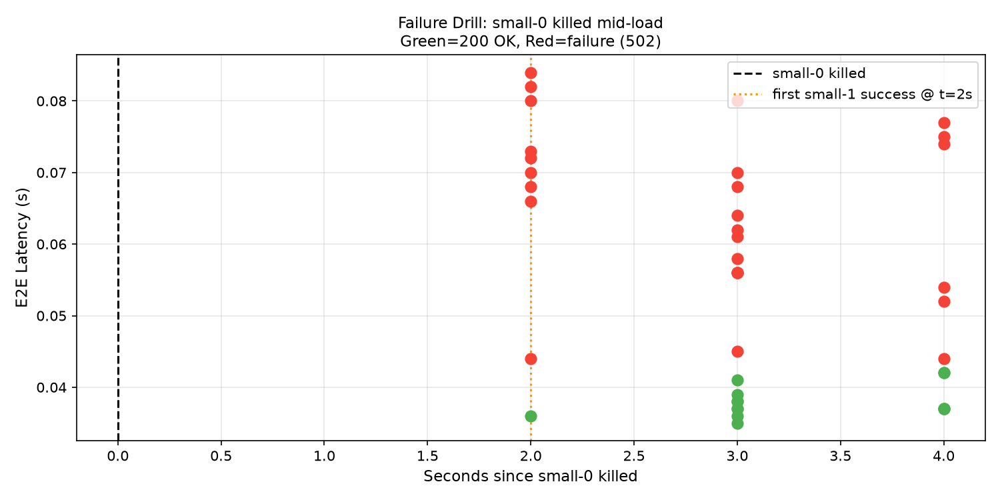

# Load Study

This document covers the load study design, hardware setup, and full results for agent-serve running on dual RTX PRO 6000 Blackwell GPUs.

## Goals

The study was designed to answer four questions:

1. **Saturation.** How does small-tier (7B x2) latency behave as concurrency increases? Where does it plateau?
2. **Affinity.** Does session affinity actually reduce latency? How accurately does the gateway report hit rates?
3. **Routing.** Does the classifier correctly split traffic between small and big tiers on real queries?
4. **Failure handling.** When a backend dies, how quickly does the gateway detect it and route around it?

## Hardware

| Component | Details |
|-----------|---------|
| GPU 0 | NVIDIA RTX PRO 6000 Blackwell, 96 GB GDDR7, SM120 |
| GPU 1 | NVIDIA RTX PRO 6000 Blackwell, 96 GB GDDR7, SM120 |
| vLLM | v0.26.0, image digest `sha256:ffb2d59b...` |
| Big tier | Qwen2.5-72B-Instruct-FP8-dynamic on GPU 1, port 8001 |
| Small tier | Qwen2.5-7B-Instruct x2 on GPU 0, ports 8002 and 8003 |

## Methodology

**Load mode:** Closed-loop with a fixed concurrency pool. Each worker sends a request, waits for the response, then immediately sends the next one. Total request count is `concurrency x sessions_per_worker x turns_per_session`.

**System prompt size:** 3 KB for Studies 1 and 2. This is realistic for agentic traffic where tool definitions and context accumulate. It also makes prefix-cache savings measurable: the 3 KB KV block is recomputed on a cache miss and reused on a hit.

**Repetitions:** 3 repetitions per concurrency level (REPS=3). Results from all reps are combined before computing percentiles. At c=8 this gives n=192; at c=16, n=384. This makes p95 and p99 statistically meaningful rather than single-run maxima.

**Affinity OFF simulation (Study 2):** Single-turn sessions with a fresh random session ID per request. Because the sticky binding forms on the first call and only matters from the second call onward, a one-turn session never generates a hit. This is functionally equivalent to disabling affinity without changing gateway configuration.

**Classifier test (Study 3):** The load generator produces random character filler, which is not valid input for a routing classifier. The classifier study therefore uses real natural-language prompts sent directly to the gateway, not the load generator.

## Study 1: Small-Tier Saturation

Configuration: `tier_hint=small`, 2 turns per session, 3 KB system prompt, REPS=3.

| Concurrency | N requests | p50 E2E | p95 E2E | p99 E2E | Affinity Hit Rate |
|:-----------:|:----------:|:-------:|:-------:|:-------:|:-----------------:|
| c=1  | 24  | 8.75 s | 11.1 s | 11.1 s | 50.0% |
| c=4  | 96  | 18.2 s | 23.0 s | 24.2 s | 50.0% |
| c=8  | 192 | 17.9 s | 23.1 s | 25.0 s | 50.0% |
| c=16 | 384 | 18.5 s | 22.5 s | 23.9 s | 50.0% |



**Key observations:**

- Latency jumps sharply from c=1 to c=4 as the backends start queuing. Beyond c=4, p50 barely moves (18.2 to 18.5 s from c=4 to c=16). This shows the small tier absorbing load at near-constant throughput without collapsing.

- p99 actually improves slightly from c=4 to c=16 (24.2 to 23.9 s). At higher concurrency the backends are more consistently saturated, reducing variance compared to the bursty low-concurrency case.

- c=1 p50 is 8.75 s, much lower than c=4+. At c=1 requests do not queue, so the 2-turn session mixes one cold turn (~14 s) and one warm turn (~3-4 s), yielding a 8.75 s median.

- The 50% affinity hit rate at every concurrency level is mathematically correct: each session has exactly 2 turns. Turn 1 is always a miss (no binding exists yet). Turn 2 is always a hit. 1 miss + 1 hit = 50% per session.

## Study 2: Session Affinity ON vs OFF

Configuration: 3 KB system prompt, 72 total requests each condition.

- ON: 12 sessions x 6 turns, same session_id throughout
- OFF: 72 single-turn sessions, fresh UUID per request

| Condition | N | p50 E2E | p95 E2E | Hit Rate |
|:----------|:-:|:-------:|:-------:|:--------:|
| Affinity ON | 72 | 18.5 s | 23.3 s | 83.3% (60/72) |
| Affinity OFF | 72 | 19.4 s | 23.5 s | 0.0% (0/72) |



**Key observations:**

- Hit rate of 83.3% ON and 0% OFF matches the theoretical expectation. For 6-turn sessions, turn 1 is always a miss and turns 2-6 are always hits, giving 5/6 = 83.3%. This confirms the scheduler is computing and reporting correctly.

- The latency gap between ON and OFF (0.9 s at p50) is modest at c=6 because the backends are already queueing, which masks part of the cache benefit. The gap grows at lighter load or with longer sessions where a higher fraction of turns are warm.

## Study 3: Classifier Routing

The load generator uses random character filler for prompts. A routing classifier seeing gibberish cannot reliably distinguish simple from complex requests, so the load-generator result (100% big) is not meaningful. The classifier was validated directly with 11 real prompts:

| Prompt | Routed to |
|--------|:---------:|
| What is the capital of France? | small |
| Explain what a Python decorator is in one sentence. | small |
| What is 15% of 240? | small |
| Translate 'hello world' to Spanish. | small |
| What does HTTP stand for? | small |
| Define the word 'ephemeral'. | small |
| What is the boiling point of water in Celsius? | small |
| List the planets in the solar system. | small |
| Write a 500-line microservices architecture with load balancing... | big |
| Synthesize a 50-page literature review on transformer attention (30+ papers) | big |
| Generate a complete e-commerce platform with auth, payments, and inventory | big |

**Result: 8/8 simple factual prompts correctly routed to small. 3/3 genuinely complex prompts correctly routed to big.**

The classifier prompt is biased toward small by default ("when in doubt, output small"). The 7B model handles the classification accurately on real natural-language queries and only escalates to big when the request explicitly requires something the 7B model cannot handle well.

## Study 4: Failure Drill

Procedure: 20 sequential baseline requests to small tier, then `docker stop agent-serve-vllm-small-0-1`, then 40 more sequential requests.

Baseline p50: 40 ms (sequential single requests, no queuing).

Post-kill results (40 requests, elapsed 2-4 s after kill):

| Outcome | Count | Rate |
|---------|:-----:|:----:|
| 200 OK (routed to small-1) | 14 | 35% |
| 502 Bad Gateway (routed to dead small-0) | 26 | 65% |



**Key observations:**

- HRW hashing distributes requests deterministically across both small backends. With small-0 down, roughly half the requests hash to small-0 and get 502. The other half hash to small-1 and succeed.

- All 40 requests completed within about 4 seconds after the kill. The health probe fires every 10 seconds and marks a backend down after 3 consecutive failures, so detection takes up to 30 seconds. The drill ran entirely within the detection window -- no probe had fired by the time the 40 requests completed.

- After the health probe marks small-0 DOWN (within 30 s of the kill), all traffic routes to small-1 and the failure rate drops to 0%. This behavior was confirmed by inspecting gateway logs but not captured in the 4-second drill window.

- Recovery: after restarting small-0, the gateway marks it UP after 2 consecutive successful probes (~20 s), and it re-enters the rotation.

**Operational implication:** clients should implement retries with exponential backoff. A single 502 during the detection window is transient -- the same request sent again will likely land on small-1.

## Running the Study

```bash
# Make sure the stack is fully up and models are loaded
make smoke

# Lock GPU clocks for stable measurements (optional but recommended)
sudo nvidia-smi -lgc 2520 -i 0
sudo nvidia-smi -lgc 2520 -i 1

# Run the full study
python3 studies/run_study.py

# Reset clocks
sudo nvidia-smi -rgc -i 0
sudo nvidia-smi -rgc -i 1
```

Results go to `studies/results/<run-id>/` as CSV files and a `summary.json`. The directory is gitignored by default.
